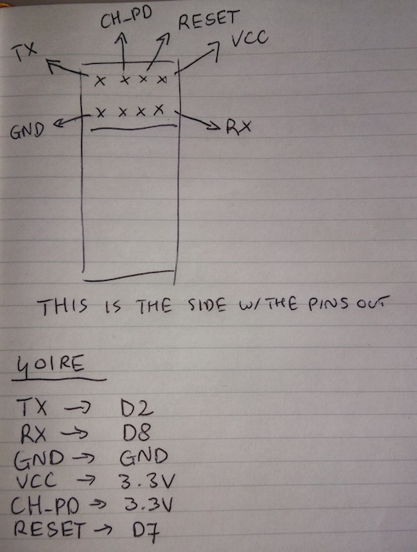

# RISE IoT workshop

Welcome at the RISE IoT Workshop with ARM mbed! If you have any questions, please just give a shout out to Jan, Liyou or Jonny, we're here to help everyone make the most of today.

In this workshop we'll first work together on some examples. Jan will demonstrate them at the stage, but this document should help you in case you're stuck or didn't completely follow along. If you feel you're way faster than everyone else, please first help your neighbours. After that feel free to continue at your own pace. After we've worked through the examples, grab some sensors and start hacking!

Reading this doc after RISE? Not a problem. Get an mbed enabled BLE board (nRF51-DK or TinyBLE for example), and just follow along.

> If you happen to much faster than everyone else, help your neighbours. We're social!

## Setup

### Tiny BLE

1. Connect the board to your computer using the micro-USB cable.
1. The board mounts as a mass-storage device (like a USB drive). Verify that you can see it (drive name will be MBED).
1. Click on [this link](https://developer.mbed.org/platforms/Seeed-Tiny-BLE/add/) (sign up for an ARM mbed account when prompted).
1. Then click on [this link](https://developer.mbed.org/compiler/#import:/users/janjongboom/code/BLE_LED_Button/;platform:).

### ST Nucleo

1. Connect the board to your computer using the mini-USB cable.
1. The board mounts as a mass-storage device (like a USB drive). Verify that you can see it (drive name will be MBED).
1. Click on [this link](https://developer.mbed.org/platforms/ST-Nucleo-F401RE/) (sign up for an ARM mbed account when prompted).
1. Then click on [this link](https://developer.mbed.org/compiler/#import:/users/janjongboom/code/BLE_LED_Button/;platform:).

The following steps will be the same for both platforms.

1. Click *Import* to add the program to your online compiler.
1. In the tree, select *main.cpp* to open the file in the editor.
1. Find the following line:

    ```cpp
    const static char     DEVICE_NAME[] = "MY_BLE_DEVICE";
    ```

1. Change `MY_BLE_DEVICE` into a name of your own choosing.
1. Hit the *Compile* button. After a few seconds a file will download.
1. Your board is mounted as a mass-storage device (like a USB drive). Drag this file onto your board (should be named `MBED`).
1. The green LED should start blinking. The application is loaded onto the board!

**On Windows:** For basic usage you don't need to install anything, but if you want to see debug messages, install the [serial driver](https://developer.mbed.org/handbook/Windows-serial-configuration).

**Debug messages:** We can talk to the board via a serial port, but you might need some software. Read [this doc](https://developer.mbed.org/handbook/SerialPC#host-interface-and-terminal-applications) and install required software (like PuTTY on Windows).

## Building an app

We now have firmware running on the board which does the following things:

* It advertises itself every second, telling it's name and the list of services it contains.
* It allows other BLE devices to connect to it.
* It contains a service which allows you to put a LED on the board on / off.
* It contains a service which shows if a button on the board is pressed.

**Debugging Bluetooth:** If you want to verify that your board is exposing the right services, or responds in the right way, you can install nRF Master Control Panel ([Android](https://play.google.com/store/apps/details?id=no.nordicsemi.android.mcp&hl=en) [iOS](https://itunes.apple.com/us/app/nrf-master-control-panel-ble/id1054362403?mt=8)) on your phone. Very useful app.

We can now write a small application that runs on your phone, scans for BLE devices, connect to your device when it finds it and then show a UI to control the LED or read the button state. To build the app we'll be using [EvoThings Studio](http://evothings.com).

1. First search in your local app store for *EvoThings Viewer* and install the app.
1. Install [EvoThings Studio](http://evothings.com/download) on your computer.
1. On your computer start EvoThings Studio and select *GET KEY*.
1. Open the app on your phone and type the same key as you received on your computer. This is used to pair phone and computer wirelessly.
1. Download [the demo app](https://github.com/ARMmbed/rise-workshop-manchester/archive/master.zip) and unzip.
1. Drag the folder *evothings-ble-button-led* onto the *My apps* tab in EvoThings.
1. Click *Run*.
1. The app opens on your phone. Type the name of your device (same one you typed in earlier) and hit *Connect*.
1. We now have a phone app and a device talking to eachother!

**Note:** To see debug messages (`console.log`, etc.), click *Tools* in EvoThings Studio.

## Adding external peripherals

> Already an acquainted hardware hacker? Feel free to skip this part, and go straight to hacking on your own project.

We're currently toggling the built-in LED and using the built-in button. But we can also use external peripherals. We can build the same schame as we had before but on a breadboard with some resistors. Grab from the front of the room:

* A breadboard.
* An LED.
* A resistor (between 100 and 220 Ohm).
* Some male-male wires.
* Optional: a 10K Ohm resistor and a push button (but I have little of those).

Look at [this page](https://docs.mbed.com/docs/getting-started-mbed-os/en/latest/Extended_LED/) for schematics on how to hook up the LED and the button. You can ignore the code. Hook the LED up to `D0` (Nucleo) or `p3` (Tiny BLE).

After you hooked up the peripherals look in the firmware code for these lines:

```cpp
DigitalOut actuatedLED(LED2, LED_OFF);  // red
InterruptIn button(BUTTON1);
```

We can change `LED2` and `BUTTON1` to instead use the pins you hooked up the LED (and / or button) to. F.e. on Tiny BLE change this to:

```cpp
DigitalOut actuatedLED(p3);
```

## Extra examples

Here's some small projects that you can now do.

### Using different inputs

Instead of a button we can use any other type of input. For example a motion sensor (PIR sensor) which triggers when it detects movement using infrared light. Take one of the sensors from the front of the room (if in doubt, ask us!) and hook these up in place of the button. For example, the PIR sensor can be hooked up to 5V (+), GND (-) and a pin. Use the same code as for the button, but just change `BUTTON1` to the pin you hooked the PIR sensor to.

**Tip:** In doubt on how to connect a sensor? Google for *'[sensor] fritzing'* to get drawings for the breadboard.

### Building a color wheel

We currently only toggle the LED on or off. But we can also use 'pulse width modulation' to change the intensity of an LED. If we combine that with a tri-color LED we can make almost any color!

Hook either three LEDs or a tri-color LED up to the breadboard and to 3 pins (D0, D1, D2 on Nucleo; or p3, p4, p5 on Tiny BLE). Don't forget to connect GND as well. Then define the LEDs like this in your firmware code:

```cpp
PwmOut red(D0);
PwmOut green(D1);
PwmOut blue(D2);
```

You can set the intensity of the LED like this:

```cpp
red = 0.5f; // 50%
```

At the moment in the `onDataWrittenCallback` function we only read one byte. Change the code to read 3 bytes (value between 0-255), and set the intensity of each channel with that value.

**Tip:** To transform a value from integer to a float (which you'll need for intensity), use this:

```cpp
red = static_cast<float>(params->data[0]) / 255.0f;
```

Also change the app so you can write 3 values between 0-255, instead of just one value of 0 or 1. Maybe even add a nice colour wheel to the app!

### Detect falling or shaking with the Tiny BLE (advanced)

The Tiny BLE contains an accelerometer. [Here](https://developer.mbed.org/teams/Seeed/code/eMPL_MPU6050/) is a library for it (right click on your project > Import Library > From Import Wizard > eMPL_MPU6050); and some example code is [here](https://developer.mbed.org/teams/Seeed/code/Seeed_Tiny_BLE_Get_Started/file/24e365bd1b97/main.cpp).

Read the values from the accelerometer, or set some interrupts whenever a shake or a fall happens. Now create a new BLE service (see `LEDService` as an example) and expose this data to the outside world. Don't forget to also add the service in the `service_list` in main.cpp.

### Building a Bluetooth router (advanced)

The downside of using Bluetooth is that you need to be in the vicinity of the device to read and write data. But... your phone has a connection to the internet. We can write an app that is always connected to the device, put it on a cheap phone, and connect this phone to some internet service. We can now route messages to and from the device over this phone, and talk to a device from anywhere in the world!

Here's the [5 minute introduction to Firebase](https://www.firebase.com/tutorial/#tutorial/basic/0). Add Firebase support to your app, and then stream all Bluetooth data (e.g. the button presses) back to Firebase. Try to also do the same the other way around (toggle the LED using Firebase).

## WiFi with the ESP8266

If you want to experiment with WiFi we have a number of the ESP8266 WiFi modules. It requires a bit of wiring, if you run into trouble with that, please shout and we're happy to help!

**Note:** Make sure to have set up [serial communication](https://developer.mbed.org/handbook/SerialPC#host-interface-and-terminal-applications) with your board. See the 'Setup' section for more instructions.

This is how you wire the ESP8266 to your Nucleo board:



> We might need a [voltage divider circuit](http://cdn.instructables.com/FC5/FW5J/IGHOIQAH/FC5FW5JIGHOIQAH.LARGE.jpg) because the Nucleo board uses 5V on it's TX/RX pins, but the ESP8266 only works on 3.3V.

When wired successfully the red LED should burn (status LED) and we can import some code. Click on [this link](https://developer.mbed.org/compiler/#import:/teams/ESP8266/code/ESP8266_HTTP_HelloWorld/;platform:) to import the 'ESP8266_HTTP_HelloWorld' program into the online compiler.

After importing, open *main.cpp* and change the following line:

```cpp
ESP8266Interface wifi(D1,D0,D2,"demossid","password",115200); // TX,RX,Reset,SSID,Password,Baud
```

into:

```
ESP8266Interface wifi(D8,D2,D7,"OUR_SSID","OUR_PWD",115200); // TX,RX,Reset,SSID,Password,Baud
```

Then hit *Compile* and flash the application to your board, similar to how we did it for the Bluetooth examples.
